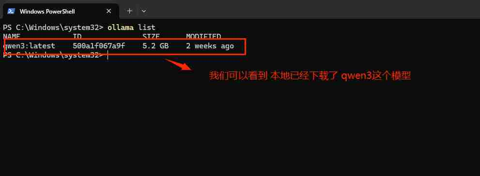

### 1.什么是ollama
```java
// 它的核心工作是简化大模型的部署流程
// Ollama 是一个开源的 本地大模型运行框架。如果把大模型（如 Llama 3、通义千问 Qwen 2.5）比作“游戏程序”，那么 Ollama 就是那个“游戏引擎”或“播放器”，让你能在自己的电脑上直接运行这些模型。
```
### 2.解决了什么问题
#### 没有ollama之前
```java
// 在本地运行大模型需要配置复杂的 Python 环境、安装各种依赖库（如 PyTorch）、处理显卡驱动兼容性等。
```
#### 有了ollama之后
```java
// Ollama 将模型和运行环境打包在一起，让用户通过简单的命令行（如您文档中提到的 ollama run qwen3）就能一键启动模型。
```

### 3.ollam安装部署好后 最常用的命令
#### 3.1 查看本地已经下载了哪些模型
```java
ollama list
```

---
#### 3.2 拉取模型到本地
```java
ollama pull <模型名>
```
---
#### 3.3 运行指定的模型
```java
ollama run <模型名>
```
---
#### 3.4 删除本地模型
```java
ollama rm <模型名>
```
---


