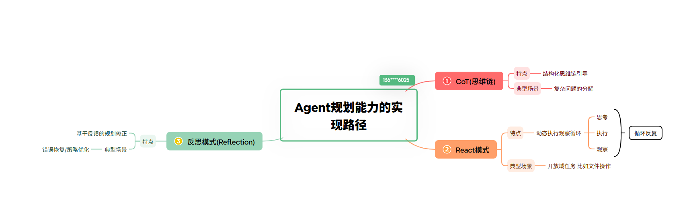

#### 问题1:什么是Agent
> 广义的理解
```java
    // 【感知环境】 + 【作出决策】
```
***
> 基于大语言模型(LLM)的智能体
```java
AI智能体（AI Agent）是指一种具备自主感知、推理决策和执行行动能力的人工智能系统。与传统仅用于问答或生成内容的AI不同，AI智能体更像是一个“数字化员工”，能够在无需人类持续干预的情况下，主动规划路径并调用工具完成复杂任务
AI智能体是一个能够感知环境、处理信息、基于目标做出决策并执行动作的实体  2 3。其本质是**大模型（LLM）+ 规划（Planning）+ 记忆（Memory）+ 工具（Tool）**的结合
```
***
#### 问题2:LLM智能体的核心组件
- 感知（Perception）
```java
作为智能体的“眼睛”，通过多模态技术（如计算机视觉、NLP）理解屏幕UI、文本、语音等环境信息 
```
- 规划（Planning）
```java
作为“大脑”的逻辑中心，能将复杂的宏观目标（如“分析报表并邮件发送”）拆解为微观的可执行步骤，并具备自我反思和路径修正能力 
```
- 记忆（Memory）
```java
短期记忆：利用上下文窗口记录当前任务进展 
长期记忆：通过向量数据库存储历史经验和私有知识，以支持复杂问题的处理 
```
- 工具使用（Tool Use）
```java
智能体能自主调用外部API、搜索引擎、计算器或软件接口，通过物理或数字手段执行具体动作 
```
***

## Agent规划的实现路径

> 规划的能力 直接决定了 模型能处理复杂任务的复杂程度
```java
// 1.CoT    技术特点:结构化思维链引导   典型场景:复杂问题分解
// 2.React  技术特点:动态执行观察循环   典型场景:开放域任务（如文件操作）
// 3.反思模式 技术特点:基于反馈的规划修正 典型场景:错误恢复/策略优化
```
***
### 3.什么是 思维链（Chain of Thought, CoT）
#### 3.1 是什么
```java
思维链（Chain of Thought, CoT）是一种引导大语言模型通过中间推理步骤来解决问题的提示技术 1。其核心理念是要求AI在给出最终答案之前，先展示完整的思考过程，就像人类解题时写出详细步骤一样 1 2。
核心原理
- 逐步推理：将复杂问题分解为一系列更小的、易于处理的子问题或中间步骤，形成一条逻辑链条
- 模拟人类思考：模仿人类“先理解题目→列出条件→选择公式→逐步计算→得出结论”的过程，避免直接“猜”答案
- 降低错误率：通过显式展示推理过程，迫使模型启动“慢思考模式”，从而显著减少幻觉和计算错误，提高复杂任务（如数学、逻辑、代码）的准确率
```
#### 3.2 思维链的主要形式
- Few-shot CoT（少样本思维链）：在提示词中提供几个包含详细推理步骤的示例，引导模型模仿这种思考方式
- Zero-shot CoT（零样本思维链）：不需要提供示例，只需在提示词中加入类似“让我们一步步思考”（Let’s think step by step）的指令，即可激发模型的推理能力
***
### 4.什么是ReAct模式（Reasoning + Acting）
#### 4.1 是什么
```java
ReAct 模式（Reasoning + Acting）是一种让大语言模型（LLM）通过交替进行推理和行动来解决复杂任务的智能体（Agent）架构范式。它由普林斯顿大学和谷歌研究院在 2023 年的论文《ReAct: Synergizing Reasoning and Acting in Language Models》中首次提出

思考（Thought） + 行动（Action） + 观察（Observation） 循环交替
```
#### 4.2 工作机制
```java
ReAct 将解决复杂问题的过程拆解为多个迭代循环，每个循环包含三个关键步骤 
- 思考（Thought）：模型基于当前上下文和之前的观察结果，进行内部推理，决定下一步该做什么，并生成可追溯的推理轨迹
- 行动（Action）：模型根据思考结果，调用外部工具或与环境交互（如搜索、计算、查询数据库等）
- 观察（Observation）：模型接收行动后的外部反馈（如搜索结果、计算数据），并将其作为新的输入，进入下一轮思考
```
***
#### 5.什么是反思模式(Reflection)
> 是什么
```java
指的让Agent不只是 一次性的生成结果 而是对自己的输出和行动进行批判性的审视 通过
【生成】 --- > 【评估】 --- > 【反思】 ---- > 【改进】 的闭环迭代来提升质量
```
> 核心机制
```java
整个过程通常分四步，循环往复：
1.Agent 先针对任务生成初步响应；
2.再由模型（或独立的评估角色）对输出做批判性自我评估，找出错误和不足；
3.结合评估结论调整思路和策略，重新生成；
4.反复迭代，直到满足质量目标或达到迭代上限。可抽象表示为 R(n+1) = Reflect(R(n), F)，即下一轮结果由上一轮结果加反馈反思而来（来源：官方知识库《Reflecting 模式 AI agent 规划能力中的反思机制》）。

- 生成（Generation）：Generator 接收用户输入，输出初始响应（Initial Response）
- 反思（Reflection）：Reflector 接收初始响应，基于开发者设定的标准（如准确性、逻辑性、风格等）进行评析，生成具体的反馈（Reflections），包括评语、特征分析及改进建议
- 优化（Optimization）：Generator 结合 Reflector 的反馈，对初始响应进行修改和优化，生成新的响应
- 循环（Iteration）：上述过程重复进行，形成迭代反馈循环，使输出结果逐轮变得精炼和可靠 


```
***
### 6.什么是短期记忆 - 指模型在当前对话上下文窗口内能够访问和引用的历史信息
#### 6.1 是什么
```java
短期记忆（Short-term Memory）是指个体在短时间内（通常为几秒到一分钟）暂时保持和处理少量信息的能力。它是认知心理学和神经科学中的核心概念，也是人工智能（尤其是大语言模型）架构中模拟人类认知过程的重要机制。
在大语言模型（LLM）和智能体（Agent）架构中，“短期记忆”通常指模型在当前对话上下文窗口内能够访问和引用的历史信息：
```
- 上下文窗口（Context Window）
```java
LLM 的短期记忆受限于其上下文窗口大小。模型只能“记住”并处理窗口内的 token（文本单元）。超出窗口的信息会被截断或遗忘，除非通过检索增强（RAG）等技术外部获取。
```
*** 
#### 6.2 短期记忆的实现方式有哪些
> Context Window（上下文窗口直通）
```java
// 原理：直接将历史对话和系统提示词（System Prompt）按顺序放入大模型的上下文窗口中。

// 特点：最直接、精度最高，但受限于上下文 token 长度限制，且 token 消耗成本随对话增长。
```
> 滑动窗口与截断（Sliding Window & Truncation）
```java
// 原理：仅保留最近 $N$ 轮对话或固定数量的 token，超过上限的早期消息自动丢弃。
// 特点：计算开销可控，适合流式或短期连续对话，但会丢失较早的上下文细节。
```
> 对话摘要与压缩（Summarization & Compression）
```java
// 原理：利用轻量模型对较早的对话历史进行定期概括（Summary），将长文本压缩为一段精简的记忆节点，再与最新的对话合并。
// 特点：大幅节省上下文空间，保留核心信息，但可能遗漏关键细节。
```
> 向量检索 / RAG（基于 Vector Database 的暂存）
```java
// 原理：将当次会话的交互实时向量化（Embedding），存入轻量内存数据库（如 Redis、Faiss 或内存向量表）。当 Agent 需要回答时，通过语义相似度检索最相关的短期记忆片段。
// 特点：打破严格的上下文长度限制，支持快速局部提取。
```
> 结构化工作内存（Working Memory / Key-Value Store）
```java
// 原理：将短期关键信息抽取为结构化数据（如 JSON、键值对或状态机），动态更新变量（例如用户的临时需求、当前步骤状态）。
// 特点：精确度高、不易出现幻觉，常用于复杂流程控制（如 ReAct 架构中的思考过程暂存）。
```
***
### 7.长期记忆
#### 7.1 是什么
```java
// 在当前 AI 领域（特别是大语言模型和 Agent 架构）中，长期记忆解决了大模型“上下文窗口有限”以及“会话结束后会遗忘”的问题
在大语言模型（LLM）及智能体架构中，长期记忆通常指超出当前上下文窗口限制的历史信息存储机制：
- 向量数据库（Vector Database）：将对话历史或文档转化为向量嵌入（Embedding），存储在数据库中。当需要回忆时，通过语义相似度检索相关片段，注入到当前的短期记忆（上下文窗口）中。
- 参数化记忆：通过微调（Fine-tuning）将特定知识固化到模型权重中，但这部分知识是静态的，难以动态更新。
- 外部知识库（RAG）：利用检索增强生成技术，让模型在回答时访问外部长期存储
```
#### 7.2 实现的方式有哪些
> 向量数据库与语义检索（Vector Databases / RAG）
```java
// 原理：将用户的历史对话、偏好、知识库文本切块并通过 Embedding 模型转化为向量，存入向量数据库（如 Milvus、Pinecone、Chroma 等）。

// 作用：当用户提问时，Agent 通过相似度检索召回相关的历史知识，充当 Agent 的语义记忆与情景记忆。
```
> 参数化记忆（Parametric Memory / 微调与预训练）
```java
// 原理：通过预训练（Pre-training）、SFT（指令微调）或 LoRA 等技术，直接将知识和规则“烧录”进大模型的权重参数中。

// 特点：知识融会贯通、响应极快，但更新成本高且容易产生幻觉。
```
> 动态用户画像与图谱（User Profiles & Knowledge Graphs）
```java
// 原理：Agent 在交互过程中提取用户的长期偏好、事实事实关系（如习惯、技术栈、地理位置），并整理成结构化的 JSON 配置文件或知识图谱。

// 作用：提供稳定、跨会话的一致性个性化服务。
```
> 外部文件与本地存储（File-based / Memory Files）
```java
// 原理：Agent 自动维护本地文件（如 MEMORY.md 或数据库表），在每次启动或特定时刻进行读取、追加和重构。
```
***
#### 8.【短期记忆】 与 【长期记忆】的区别
```java
// 1.短期记忆
    // 1.1 持续时间  - 短暂(秒/分钟级)
    // 1.2 容量 - 有限（几个组块）
    // 1.3 编码方式 - 	主要是声学或视觉编码
    // 1.4 AI 对应物 - 上下文窗口内的 Token

// 2.长期记忆
    // 2.1 持续时间 - 持久（小时至终身）
    // 2.2 容量 - 几乎无限
    // 2.3 编码方式 - 主要是语义编码
    // 2.4 AI 对应物 - 向量数据库、知识库、微调参数
```
***
#### 9.AI Agent常用的感知方式分为两类？
AI Agent 的感知方式通常可以从**交互模态（数据类型）和处理机制（时间维度）**两个主要维度进行分类
> 按感知模态分类（数据类型）
```java
- 语言交互感知：通过自然语言处理（NLP）技术，理解和生成文本或语音指令，与人类进行有效沟通
- 视觉感知：通过计算机视觉技术，识别和理解图像、视频等视觉信息
- 听觉感知：通过语音识别技术，理解和处理语音信息
- 多模态融合感知：综合处理视觉、听觉、文本等多种渠道信息，打破模态壁垒，
```
***
> 按处理机制分类（时间/记忆维度）
```java
反应型感知（Reactive）：仅基于当前的感知信息做出即时反应，忽略历史感知数据。适用于环境完全可观察且历史信息不影响当前决策的简单场景（如简单反射型 Agent）
记忆型/基于模型的感知（Deliberative/Model-Based）：不仅接收当前感知，还维护一个内部世界模型，结合历史感知数据进行更新和理解。这使得 Agent 能够处理部分可观察的环境，理解行为对环境的影响，并基于过去信息进行更复杂的决策
```
***
#### 10.Agent的典型任务执行流程是什么？
AI Agent 的典型任务执行流程通常是一个闭环系统，主要包含以下四个核心阶段 
- 感知环境 (Perception)
```java
Agent 通过接口接收用户指令、系统状态或外部数据，理解当前上下文和目标 
```
- 制定计划 (Planning)
```java
基于感知到的信息和目标，Agent 利用大语言模型进行推理，将复杂任务分解为可执行的子步骤，确定依赖关系和执行顺序
常见模式：如 Plan-and-Solve（先规划后执行）模式，强调“先谋后动”，确保目标一致性
```
- 执行行动 (Action)
```java
Agent 根据计划调用相应的工具（如搜索、代码执行、API 访问等）来执行具体步骤，并实时监控执行结果
常见模式：如 ReAct（Reasoning + Acting）模式，采用“思考-行动-观察”的循环迭代方式，适合动态探索场景
```
- 评估与反馈 (Evaluation & Feedback)
```java
Agent 评估任务完成情况或中间结果。如果任务未完成、出现错误或环境发生变化，Agent 会进行反思（Reflection），调整计划并重新执行，直到任务成功完成
```
***
- 例子
```java
感知：接收用户指令“帮我整理本周项目进展”。
规划：拆解为“搜索文档”、“查询工单系统”、“读取会议纪要”、“汇总信息”、“生成报告”等步骤。
执行：依次调用搜索工具、数据库查询工具等获取数据。
评估/输出：检查数据完整性，生成结构化报告并返回给用户。
```
***
### 11.触发模型推理有哪3种常见的模式？
#### 11.1 实时推理（Real-time Inference）
```java
这是最常见的交互模式，适用于对延迟敏感的场景。
- 特点：用户发送请求后，系统立即处理并返回结果。为了提升用户体验，常采用**流式输出（Streaming）**技术，即生成一个Token就返回一个Token，降低首字延迟
- 适用场景：聊天机器人、实时翻译、客服助手等需要即时反馈的应用 
- 技术支撑：通常通过API端点调用，支持自动扩缩容以应对流量波动
```
#### 11.2 批量推理（Batch Inference）
```java
- 特点：将成千上万条Prompt作为单一任务（如夜间任务）进行集中处理。这种方式可以最大化利用计算资源，显著降低单位成本
- 适用场景：数据清洗、大规模文档分析、模型评估、非实时的推荐系统更新等
- 优势：无需为闲置资源付费，吞吐量高，适合离线数据处理
```
#### 11.3 远程/无服务推理（Remote/Serverless Inference）
```java
- 特点：用户无需配置GPU或维护基础设施，只需调用API端点。计费模式通常为按Token计费，无请求时不产生闲置成本
- 适用场景：早期应用开发、实验性场景、负载波动大且无法预测峰值的业务
- 技术实现：模型托管在外部服务器或云端，应用通过API进行远程调用，便于集中化管理模型版本和监控
```
***
### 12.根据项目需求，AI Agent有哪两种开发范式？
根据项目需求，AI Agent 的两种主要开发范式通常指 ReAct（反应式） 与 Plan-and-Execute（规划执行式）
-  ReAct 范式（边想边做）
```java
核心逻辑：推理与行动交错进行。Agent 在每一步都先“思考”（Thought），决定调用什么工具或采取什么行动（Action），然后“观察”反馈（Observation），再进入下一步
特点：灵活性强，适合流程不固定、需要即时调整和探索的任务 
```
- Plan-and-Execute 范式（先谋后动）
```java
核心逻辑：先制定全局计划，再按步骤执行。Agent 首先将复杂任务拆解为一系列子任务（Plan），然后依次执行这些子任务（Execute）
特点：结构化强，适合流程明确、步骤固定的任务，能有效降低 Token 消耗（可用强模型规划、弱模型执行）
适用场景：自动化部署、批量数据处理、标准作业流程（SOP）执行
```
- 选型建议
```java
若任务简单或路径不确定，选择 ReAct；
若任务流程长、复杂且需整体规划，选择 Plan-and-Execute
实际工程中常采用混合范式：用 Plan-and-Execute 定全局计划，用 ReAct 执行具体步骤
```
***


