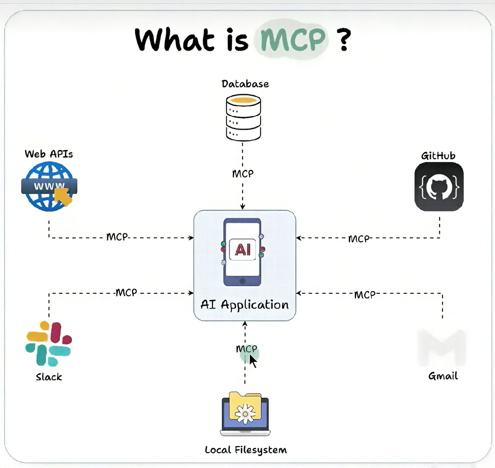
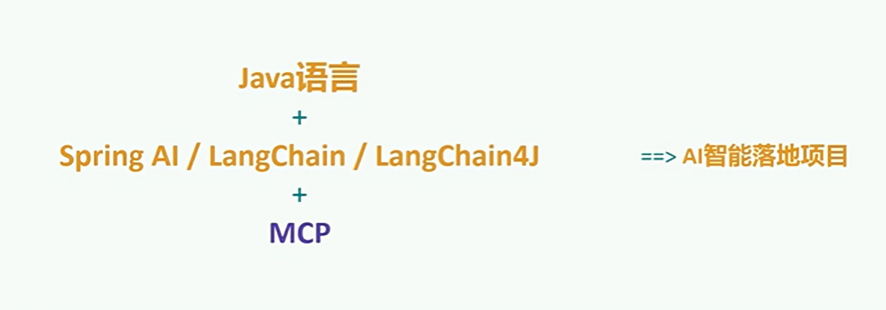
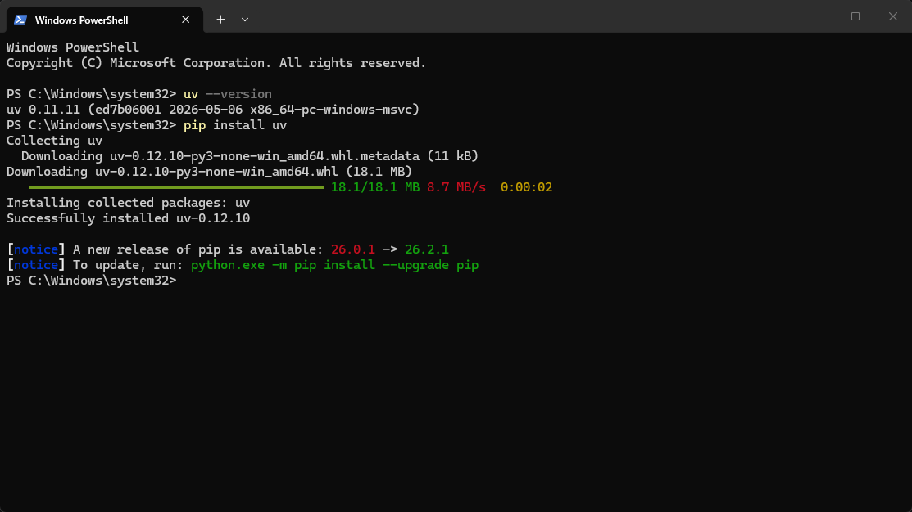
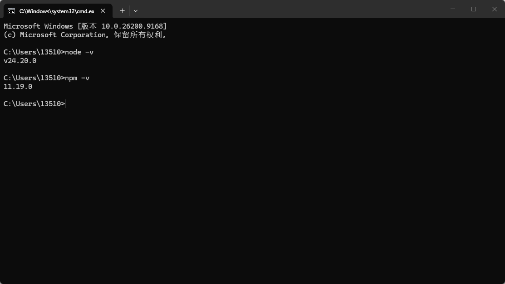
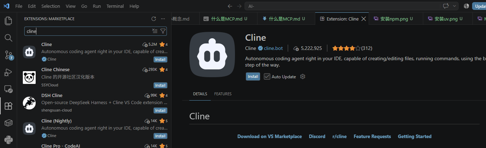
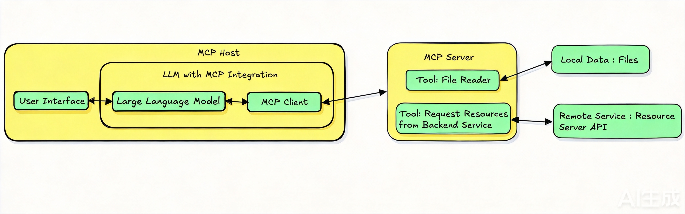
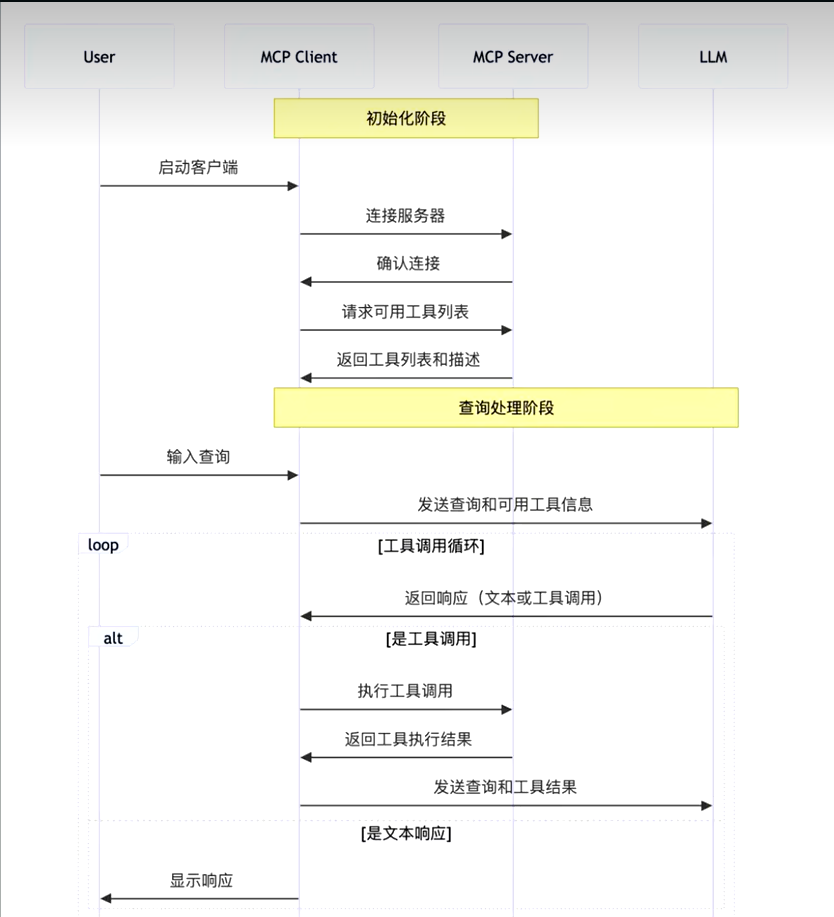
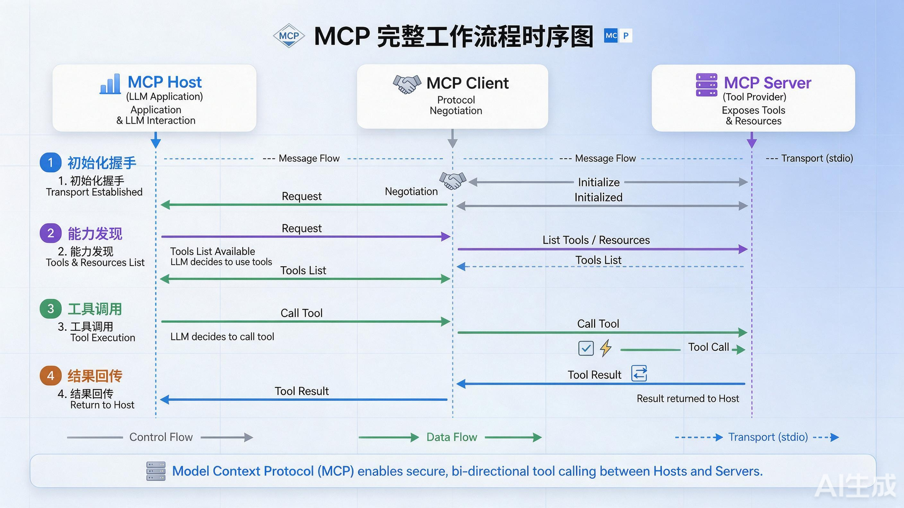

#### 1.为什么会出现MCP
> 存在的问题
```java
// 1.Agent如何与外部的工具(Tools)进行交互
// 2.不同平台的Agent之间 如何通过协作的方式来完成任务
```
***
#### 2.MCP是大模型连接世界的标准 桥梁
```java
// 只需要简单的几行代码 就可以接入海量的外部工具
```

***
#### 3.AI智能落地的项目

***
#### 4.MCP是什么(Model Context Protocol，模型上下文协议)
> 是什么
```java
// MCP（Model Context Protocol，模型上下文协议） 是由 Anthropic 于 2024 年底开源的一种开放标准协议，旨在统一 AI 大模型（LLM / Agent）与外部数据源、工具及服务之间的交互方式。
```
> 官网
```java
// https://modelcontextprotocol.io/docs/2026-07-28/getting-started/intro#what-can-mcp-enable
```
> MCP的通讯机制
> > MCP（Model Context Protocol）底层采用 JSON-RPC 2.0 作为消息传输格式，并原生支持 STDIO 和 SSE 两种通信机制
- STDIO（标准输入/输出机制）默认是这个
```java
   // MCP Client | MCP Server都运行在本地
```

- SSE（Server-Sent Events / HTTP 机制）

***

#### 5.stdio的本地环境的安装
> 为什么需要安装本地环境
```java
// 由于 STDIO（标准输入/输出机制）默认是这个通讯机制 MCP Client | MCP Server都运行在本地 所以我们需要在本地搭建运行MCP Server的环境
```
> 分类
- 如果MCP Server是用Python语言编写的  需要安装python环境  ----- > uvx指令
```java
  // 1.1 pip install uv
```

- 如果MCP Server是TypeScript编写的   需要安装typeScript环境 ---- > npx指令
```java
   // 需要安装node.js
```

***
#### 6.哪些平台可以进行MCP的查询
```java
一、MCP官方资源类
MCP官方资源仓库：https://github.com/modelcontextprotocol/servers
这是MCP官方维护的核心资源库，收录了最权威的官方服务实现和基础文档。
二、MCP热门开源资源类
Awesome MCP Servers 精选资源合集：https://github.com/punkpeach/awesome-mcp-servers
社区维护的优质资源汇总列表，涵盖大量第三方开发的实用MCP服务、教程和拓展工具。
三、第三方MCP服务查询平台
Glama MCP Servers：https://glama.ai/mcp/servers
提供可视化的MCP服务浏览、搜索功能，支持按分类筛选不同用途的服务。
Smithery：https://smithery.ai
集成MCP服务的托管与查询能力，可直接查看各类服务的接入配置说明。
Cursor Directory：https://cursor.directory
针对Cursor编辑器生态的MCP服务聚合平台，适配本地开发场景的服务查询。
MCP.so 中文站：https://mcp.so/zh
面向中文用户的MCP服务市场，提供中文界面的服务检索、配置指引。
阿里云百炼 MCP 市场：https://bailian.console.aliyun.com/#/mcp-market
阿里云旗下的官方MCP服务平台，可直接在阿里云的AI开发链路中快速接入各类MCP能力。
```
#### 7.在vsCode Cline插件中如何配置安装使用MCP
> 需求
```java
现在交给你一个任务，编写一个北京一日游的出行攻略
1.在工作目录D:\ClineWorkSpace下创建一个新的文件夹，命名为"北京旅行"。分别从数据库 beijing_trip中获取表location_foods当地美食表、subway_trips地铁线路表的结构、数据信息。
然后提取出其中的数据，放入两个txt中进行保存
2.根据txt中的内容，生成一个精美的html前端展示北京地铁交通及周边美食的页面，并存放在该目录下
```
> 分析
```java
 // 上面的需求 需要安装哪些MCP
   // 1.操作数据库的 mysql
        // 1.1 MCP服务名称：mysqldb-mcp-server
        // 1.2 对应Smithery来源链接：https://mcp.so/zh/servers/mysql-mcp-server-pro-wenb1n-dev
   // 2.操作本地 文件夹 | 文件的MCP  desktop-commander
        // 2.1 工具名称：desktop-commander
        // 2.2 完整来源链接：https://smithery.ai/server/@wonderwhy-er/desktop-commander
```
> vsCode中安装cline


***

#### 8.MCP的原理
> 核心概念
```java
// 遵循CS架构
// 1.MCP主机(MCP Host)
// 2.MCP客户端(MCP Client)
// 3.MCP服务器(MCP Server)
// 4.本地资源(Local Resources)
// 5.远程调用(Remote Resources)
```
> 什么是MCP Host
```java
// 作为运行McP的主应用程序，例如Claude Desktop、Cursor、Cline或AI工具为用户提供与LLM交互的接口，同时集成MCP Client以连接MCP Server。
    // 封装了 LLM + MCP Client
```

***
> MCP的CS架构

> MCP 采用了标准的 Client-Server（客户端-服务器）架构：
```java
+------------------+         MCP 协议          +------------------+         连接         +------------------+
|   MCP Client     | <=======================> |    MCP Server    | <===================> |   外部资源 / API |
| (如 Claude/Agent)|    (JSON-RPC 2.0 传输)    | (工具或数据提供方) |                      | (GitHub, DB 等)  |
+------------------+                           +------------------+                        +------------------+
```
- MCP Host / Client（客户端）
```java
// 发起请求的应用（如 AI Agent 平台、IDE 编辑器、对话终端）。负责将大模型的意图转换为 MCP 请求发送给 Server，并将 Server 返回的结果回传给大模型。
```
- MCP Server（服务端）
```java
// 封装具体功能或数据的独立服务。它对外暴露标准的接口，对内操作实际的数据源（如读取本地磁盘、查询 SQL 数据库、调用远程 API）。
```
- Transport Layer（传输层）
```java
// MCP 底层使用 JSON-RPC 2.0 消息标准，支持多种传输通道：
// 1.STDIO（标准输入输出）：用于本地进程间通信（例如本地运行的 Agent 工具）。
// 2.SSE（Server-Sent Events / HTTP）：用于远程服务器通信。
```
> MCP的工作流程


***
#### 9.借助cherry-studio客户端 来使用MCP
> 什么是cherry-studio
```java
// 一款开源免费的跨平台 AI 桌面客户端，由上海千彗科技有限公司于 2024 年 12 月上线，支持 Windows / macOS / Linux / Android。它本身不带模型，定位更像"AI 模型的管理与交互中枢"——把各家大模型聚合到一个界面里，你用自己的 API Key 去调用。
多模型聚合：OpenAI、Claude、Gemini、DeepSeek、通义千问、文心一言等 300+ 模型，可同时对比多个模型的回答
本地模型：支持 Ollama、LM Studio，数据不出本机
Agent 智能体：自主规划、多轮推理、调用工具、读写文件、联网检索
RAG 知识库：导入 PDF / DOCX / PPTX / XLSX / TXT / MD、本地目录、网页链接，内置嵌入模型与重排模型配置
MCP 协议：接入第三方工具生态（联网搜索、文件操作、数据库查询等）
其他：AI 绘画、翻译、Markdown 笔记、编程工具中心（统一管理 Claude Code / Codex / Gemini CLI）
隐私：对话数据本地存储（v2.0 升级为 SQLite），支持 WebDAV 备份

```

