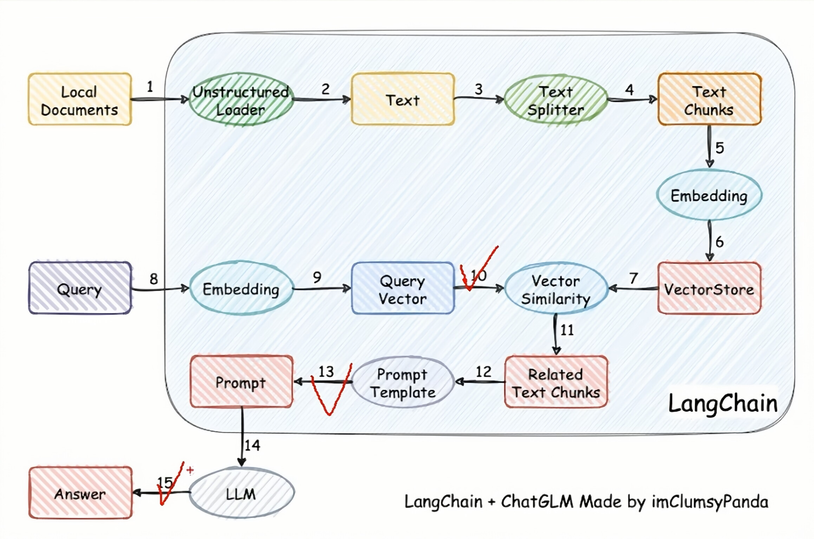
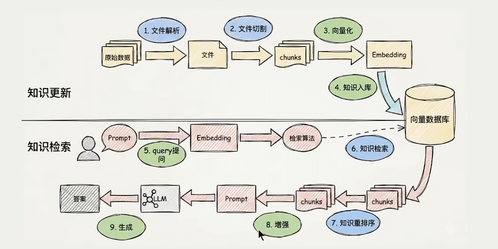
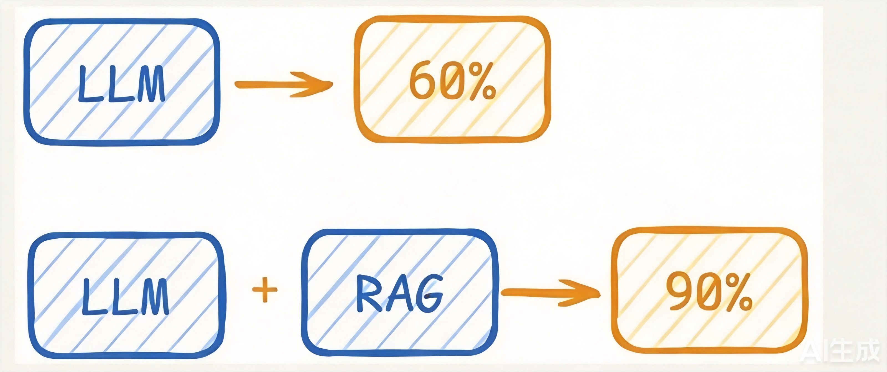

#### 1.什么是RAG  | RAG是什么
> 是什么
```java
// 检索增强生成（Retrieval-Augmented Generation，简称 RAG）是一种将信息检索与大语言模型（LLM）相结合的技术框架，旨在通过引入外部知识源，弥补大模型在事实准确性、知识时效性及私有数据访问方面的不足
```
> 核心原理
```java
RAG 的核心理念是“先检索，后生成”。它不依赖模型内部预训练的记忆来回答所有问题，而是让模型在回答前先从外部知识库中检索相关信息，基于检索到的证据组织语言
- 检索（Retrieval）：从外部数据源（如文档、数据库）中查找与用户问题最相关的内容。
- 增强（Augmentation）：将检索到的内容作为上下文补充到提示词中。
- 生成（Generation）：大语言模型结合原始问题和检索到的上下文，生成最终回答
```


> 主要优势
```java
- 减少幻觉：通过引用真实的外部数据，显著降低模型编造信息（幻觉）的概率
- 知识时效性：无需重新训练模型，只需更新外部知识库，即可让模型掌握最新信息
- 数据隐私与安全：企业私有数据无需上传至公共模型训练，仅通过检索接口使用，保障数据安全
- 降低成本：相比微调或重新训练大模型，RAG 的实施成本更低，且能灵活应对垂直领域需求 
```
> 核心流程
```java
1.索引构建（离线）：将外部文档清洗、分块（Chunking），并通过嵌入模型（Embedding）转化为向量，存储于向量数据库中
2.查询检索（在线）：用户提问后，系统将问题向量化，在向量数据库中检索语义最相似的文本块
3.生成回答：将检索到的文本块与用户问题组合，输入大语言模型，生成基于事实的回答 
```
#### RAG用来解决什么问题
> 大模型知识冻结
```java
// 大模型的知识冻结：随着 LLM 规模扩大，训练成本与周期相应增加，模型无法实时学习到最新的信息或动态变化。导致 LLM 难以应对诸如“请推荐现在的热门影片”等时间敏感的问题。
```
> 大模型幻觉
```java
// 大模型幻觉：涉及到大模型从未在训练过程中学习过的信息时，大模型无法给出准确的答复，转而开始臆想和编造答案。
```

***


