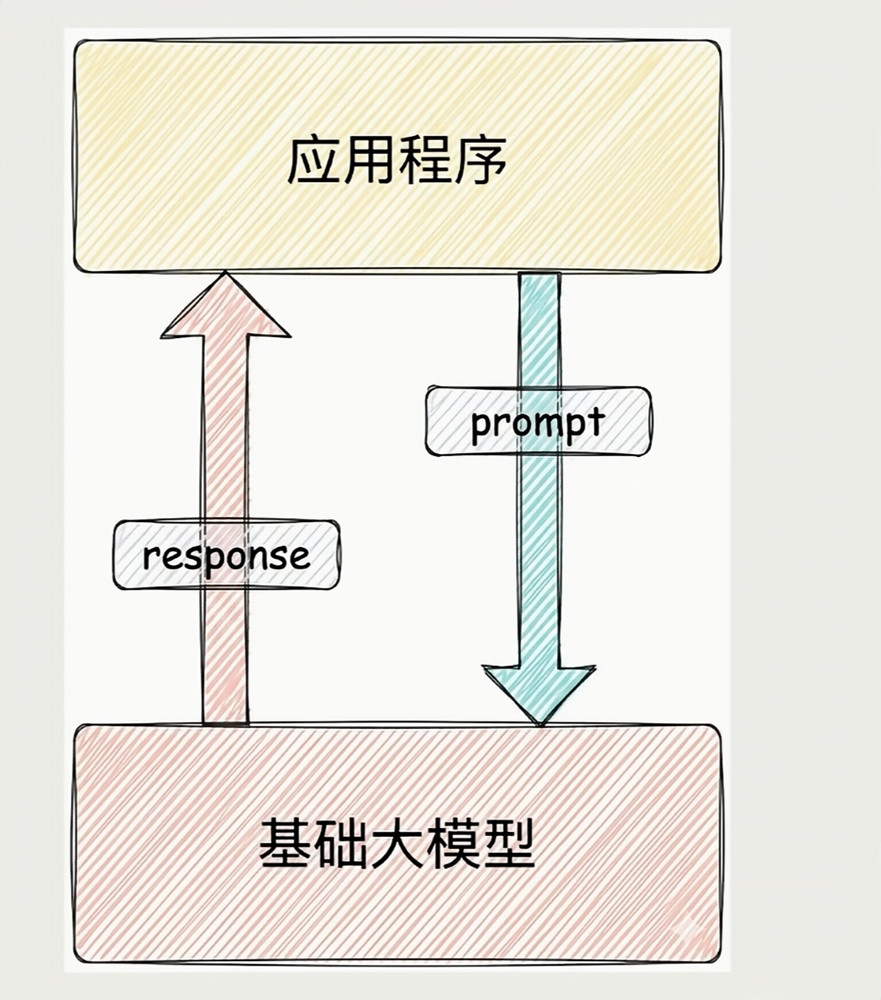
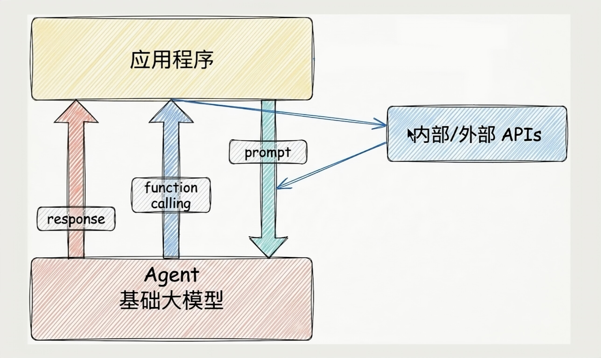
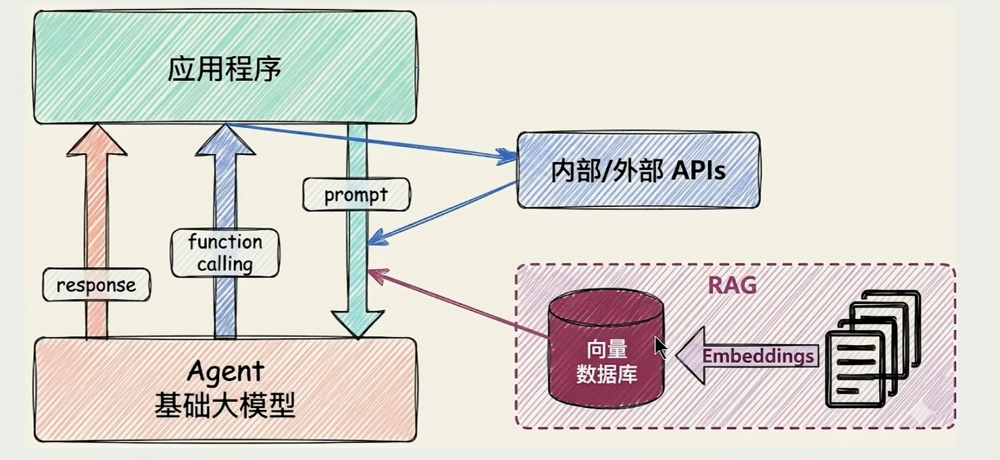
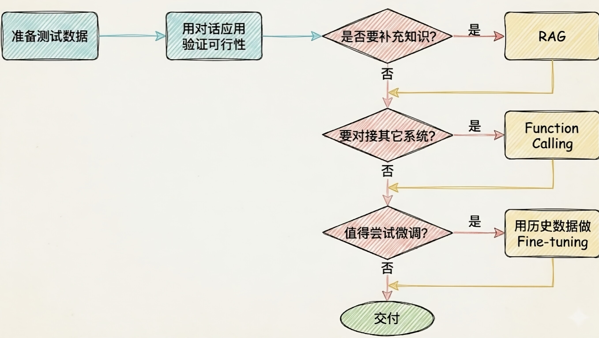

#### 场景1:纯Prompt
> 你问一句 答一句

***
#### 场景2:Agent + Function Calling
> 需要对接外部系统  AI执行某个函数

***
#### 场景3:加入了RAG
```java
RAG：需要补充领域知识时使用
- Embeddings：把文字转换为更易于相似度计算的编码。这种编码叫向量
- 向量数据库：把向量存起来，方便查找
- 向量搜索：根据输入向量，找到最相似的向量
```

***
#### 面对一个需求 如何去选择技术方案

***

