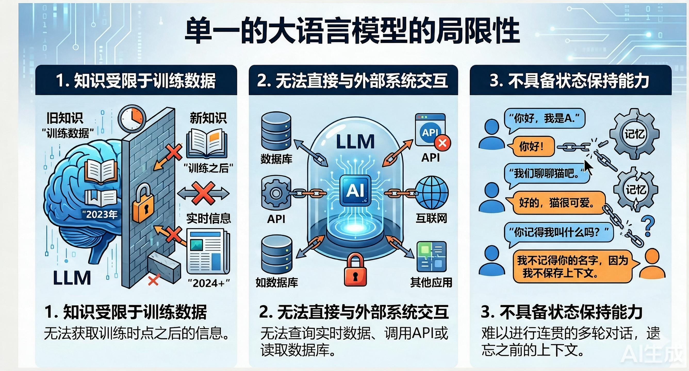
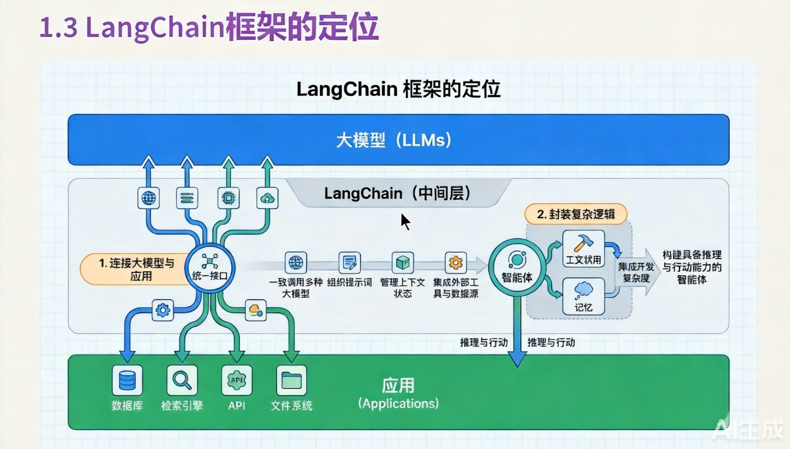
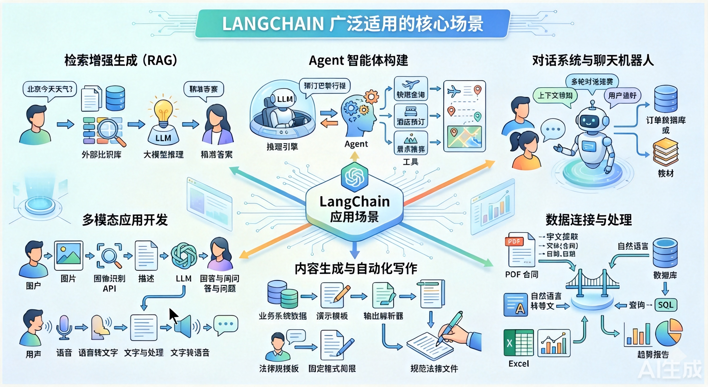
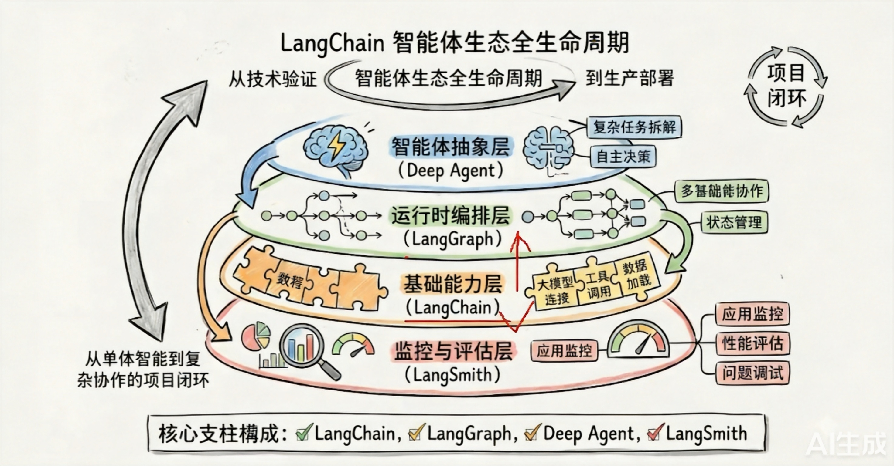
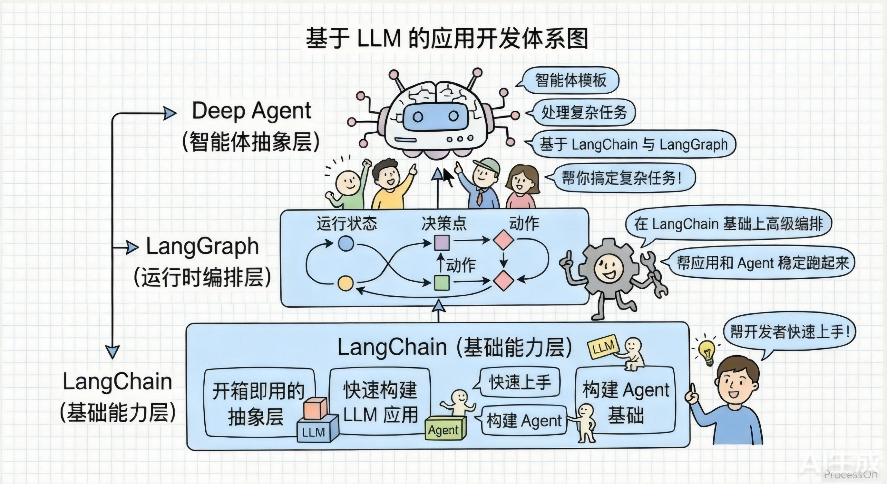

#### 学习一个东西
```java
// Why(为什么需要这个东西) + What(这个东西是什么) + How(如何使用这个东西)
```
***
#### 单一大语言模型的局限性
```java
// 1.知识受限于训练数据  (让它回答最新的实时没法回答)
// 2.无法与外部系统进行交互
// 3.不具备状态保持的能力(记忆)
```

***
| 局限 | 解决方向 |
|---|---|
| 知识截断 | RAG + 实时搜索工具 |
| 无法执行 | Agent + Tool Use 框架 |
| 幻觉/无自检 | 多模型校验、Critic 机制 |
| 复杂推理弱 | Chain-of-Thought、多 Agent 协作 |
| 无持久记忆 | 外部记忆存储 + 检索 |
| 长程规划弱 | 任务分解 + 子 Agent 编排 |

***
#### LangChain框架的定位

┌─────────────────────────────┐
│      应用层（ChatBot、RAG 等）│
├─────────────────────────────┤
│   ★ LangChain（编排框架）    │  ← 组件组装、链路编排、工具调度
├─────────────────────────────┤
│   LLM 层（OpenAI/Claude 等） │  ← 语言理解与生成能力
├─────────────────────────────┤
│   数据/工具层（DB、API、文件） │  ← 外部知识与执行能力
└─────────────────────────────┘
> 核心能力
| 能力 | 说明 |
|---|---|
| Prompt 模板管理 | 将提示词工程化、参数化、可复用 |
| Chain（链） | 将多个步骤串联：LLM 调用 → 工具调用 → 后处理 |
| Agent（智能体） | 让 LLM 动态决策选择哪些工具，实现多步任务自主执行 |
| Memory（记忆） | 为对话提供持久化状态，解决 LLM 无记忆问题 |
| Retrieval（检索/RAG） | 连接向量数据库，实现检索增强生成 |
| Tool Integration（工具集成） | 对接搜索、数据库、API 等外部能力 |

> 解决的问题
- 知识截断 → RAG + 外部数据检索
- 无法执行操作 → Agent + Tool Use
- 无持久记忆 → Memory 模块
- 复杂任务编排 → Chain + Agent 多步规划
***
#### LangChain的应用场景

```java
// 1.检索增强生成(RAG)
// 2.Agent智能体构建
// 3.对话系统与聊天机器人
// 4.多模态应用开发
// 5.内容生成与自动化写作
// 6.数据连接与处理
```
> 场景选择建议
```java
任务复杂度低 + 数据量小 → 简单 Chain（Prompt + LLM）
任务复杂度低 + 数据量大 → RAG（检索 + 生成）
任务复杂度高 + 需要执行 → Agent（工具 + 规划）
任务复杂度高 + 多步协作 → LangGraph（多 Agent + 状态图）
```
***
#### LangChain已经从一个独立的框架 发展成为了一个覆盖智能体系统的【全生命周期】的技术生态
```java
| ------ > LangChain
    | --------- > LangChain
    | --------- > LangGraph
    | --------  > Deep Agent
    | --------- > LangSmith
```

>  LangChain（基础框架层）
```java
核心定位：LLM 应用的开发工具箱。
- Prompt 模板管理与复用
- Chain（链）：将 LLM 调用、工具调用、后处理串联
- 内置 RAG 全流程组件（Document Loader → Text Splitter → Embedding → VectorStore → Retriever）
- Memory 模块，实现多轮对话记忆
- Tool 集成，对接搜索引擎、数据库、API 等外部能力
- Output Parser，将 LLM 输出结构化为 JSON/Pydantic 等格式
一句话：提供了构建 LLM 应用所需的全部基础组件。
```
>  LangGraph（复杂编排引擎）
```java
核心定位：基于状态图的多步、多 Agent 编排框架。
LangChain 的 Chain 是线性的，LangGraph 则引入了有向图：
- 支持循环、条件分支、并行执行等复杂流程控制
- 每个节点是一个处理步骤（LLM 调用、工具调用、判断等）
- 内置状态管理，节点间通过共享 State 传递信息
- 支持 Human-in-the-loop（人工介入审批节点）
- 支持多 Agent 协作与任务分工
- 支持持久化检查点，长任务可中断恢复
一句话：解决 LangChain Chain 无法处理的循环/分支/多 Agent 复杂编排。
```
> LangSmith（可观测性平台）
```java
核心定位：LLM 应用的调试、监控与评估平台。
- Trace（链路追踪）：可视化每一步的输入输出、耗时、Token 消耗
- Debug（调试）：精确定位哪一步出了问题、Prompt 是什么、模型返回了什么
- Evaluation（评估）：对输出质量打分，对比不同 Prompt/模型的效果
- Monitoring（监控）：生产环境实时监控，异常告警
- Dataset（数据集管理）：管理测试用例，批量回归测试
一句话：让 LLM 应用从"黑盒"变成"白盒"，开发调试和生产运维必备。
```
> Deep Agent（深度自主代理）
```java
核心定位：具备深度推理与自主规划能力的 Agent 框架。
- 面向需要长链推理的复杂任务（研究分析、多步决策）
- Agent 能自主分解目标、制定计划、动态调整策略
- 支持"深度研究"模式：自动搜索 → 阅读 → 综合 → 验证 → 迭代
- 更强的工具调用规划能力，不只是单次调用，而是多轮工具交互
- 强调推理质量而非速度，适合高复杂度任务
一句话：比普通 Agent 更强的自主推理能力，适合需要深度思考的复杂任务。
```
| 组件 | 核心问题 | 关键词 |
|---|---|---|
| LangChain | 怎么把 LLM 和工具/数据连起来？ | 组件、Chain、RAG、Tool |
| LangGraph | 怎么编排复杂的多步/多Agent流程？ | 状态图、循环、分支、多Agent |
| LangSmith | 怎么调试和监控 LLM 应用？ | 追踪、调试、评估、监控 |
| Deep Agent | 怎么让 Agent 自主深度推理？ | 深度规划、自主决策、长链推理 |

> 四者之间的关系
开发阶段：LangChain（基础组件）+ LangGraph（复杂编排）
    ↓
调试运维：LangSmith（可观测性）
    ↓
高级能力：Deep Agent（深度自主推理）
***
#### 从LangChain快速搭建 用LangGraph打磨生产稳定性 再用Deep Agents赋予Agent更强的自主能力

***


