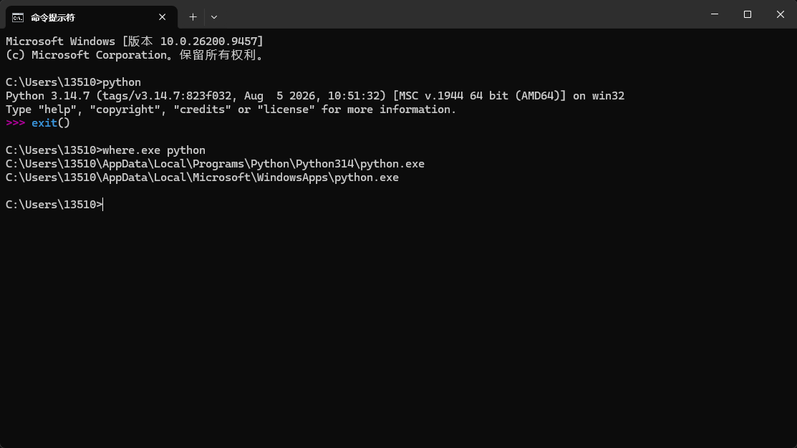
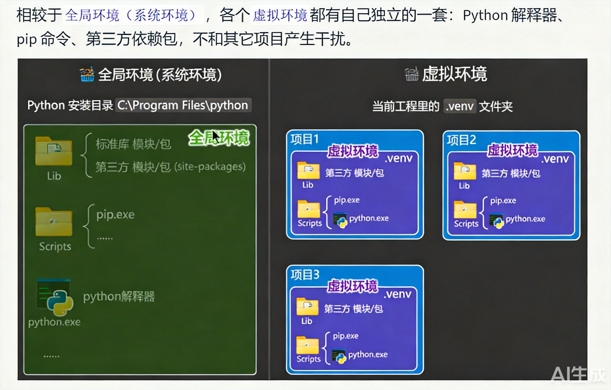
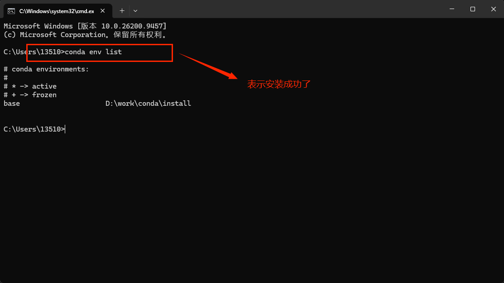
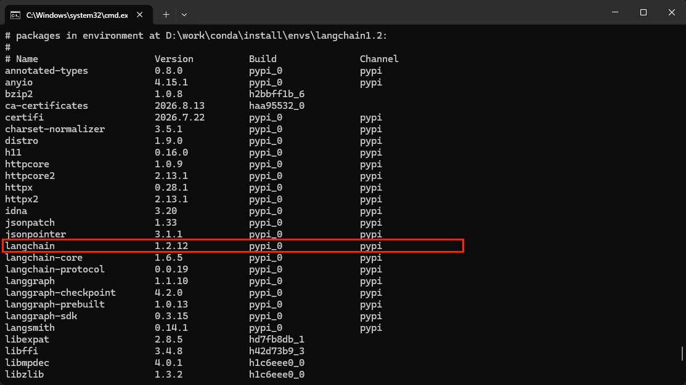
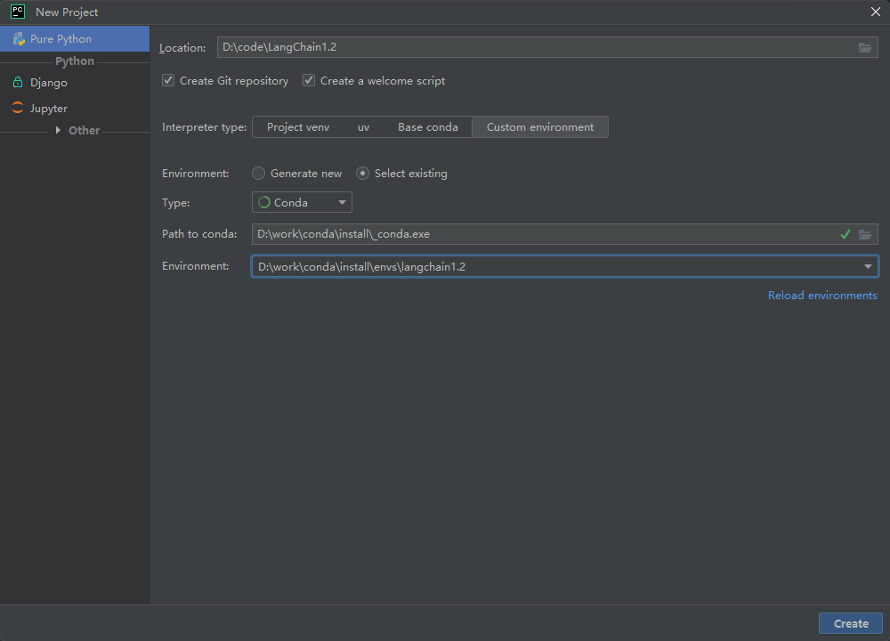

#### 如何查看python的安装路径
```java
where.exe python
```

***
#### 不同的项目 使用python的版本不一样 所以 不能只依赖于【全局环境】 我们要依赖于【虚拟环境】 
> 虚拟环境
```java
// 每一套虚拟环境 有着自己独立的  python解释器  pip命令  第三方依赖包 与其他项目不干扰
```

***
#### 使用conda搭建python项目虚拟环境


#### 什么是conda
> 是什么
```java
// Conda 是一个开源的包管理和环境管理系统，最初由 Anaconda 公司开发，主要用于 Python 生态，但也能管理 R、C/C++ 等其他语言的依赖。
// 1.包管理器
// 2.环境管理器

// 下载conda的官方网址  https://www.anaconda.com/download/success
// 历史版本 我们下载 26.1.1 归档仓库地址：https://repo.anaconda.com/miniconda/
```
> 为什么要使用conda 它解决了什么问题
> 问题1:不同项目的依赖冲突
```java
- 项目 A 需要 Python 3.9 + TensorFlow 2.x
- 项目 B 需要 Python 3.12 + PyTorch
- Conda 为每个项目创建隔离环境，互不干扰
```
> 问题2:科学计算依赖复杂
```java
- 很多数据科学库（NumPy、SciPy）底层依赖 C/Fortran 编译库
- pip 安装时经常遇到编译失败
- Conda 提供预编译好的二进制包，直接可用
```
> 问题3:复现别人的环境
```java
- 一个 environment.yml 文件就能完整复现整个运行环境
- 团队协作和论文复现非常方便
```
***
> 常见命令
```java
# 创建新环境，指定 Python 版本
conda create -n myenv python=3.11

# 激活环境
conda activate myenv

# 退出环境
conda deactivate

# 查看所有环境
conda env list

# 删除环境
conda env remove -n myenv

# 导出环境配置
conda env export > environment.yml

# 从配置文件创建环境
conda env create -f environment.yml
```
***
#### 安装conda
```java
// 下载conda的官方网址  https://www.anaconda.com/download/success
// 历史版本 我们下载 26.1.1 归档仓库地址：https://repo.anaconda.com/miniconda/
```

> 搭建开发环境
```java
#创建一个名为langchain1.2的环境，指定Python版本是3.13.12
conda create --name langchain1.2 python=3.13.12

#查看anaconda安装好的python环境
conda env list

#初始化虚拟环境 (执行完此指令，重新启动命令行窗口)
conda init

#在命令行窗口切换到某python环境
conda activate langchain1.2

#验证python版本
(langchain1.2) C:\Users\shkstart>python -V
#或 调用: python --version

```
> 安装langChain的安装包
```java
# 安装指定版本。比如1.2.2
conda install langchain==1.2.12
# 或者安装最新版（默认仓库）
conda install langchain

# 指定频道（如 conda-forge）
conda install -c conda-forge langchain==1.2.12

# 更新包
conda update langchain

# 卸载包
conda uninstall langchain

# 查看已安装包
conda list

# 有时候conda有严格的版本依赖 所以我们可以用pip安装
pip install langchain==1.2.12
```

> 将pycharm关联 conda

***


