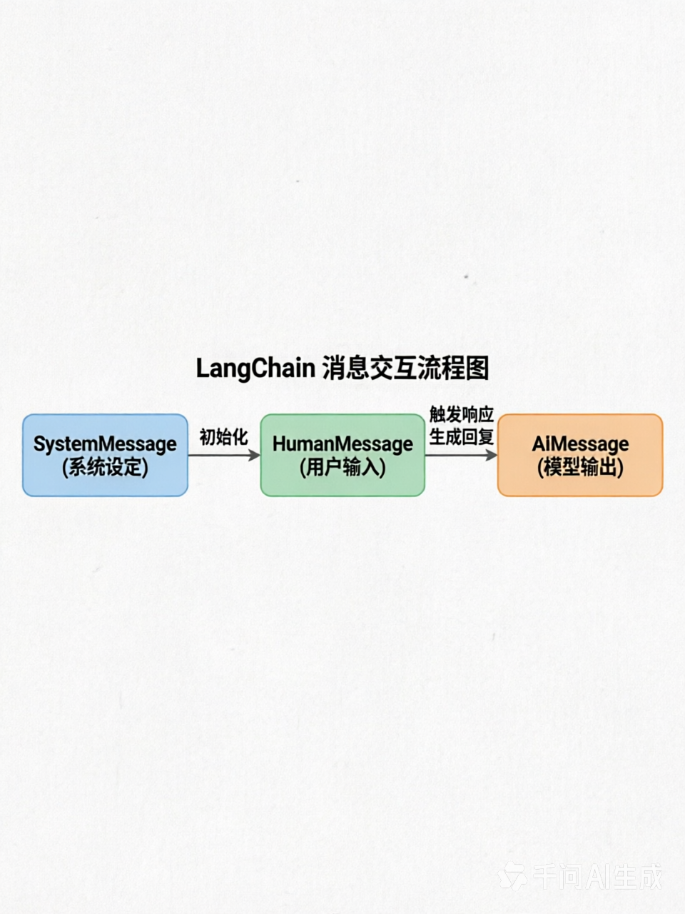

### LangChain读书笔记
#### 什么是Prompt
```java
```
#### 什么是Prompt工程
```java
// Prompt工程通过设计提示词 以确保LLM最佳输出过程称为[提示词工程] 由于LLM对提示词的变化极其的敏感 提示词非常微小的改动 会导致LLM大相径庭的输出 
```
> 一个好的【提示词】的4要素
```java
// 提示词=【立角色】 + 【叙述问题】 + 【定目标】 + 【补要求】

以下面专业的提示词来分析:
// 你现在是一个专业的软件需求分析师与应用架构师 后面的问题 请你以专业人士的视角回答 我要做员工打卡的考勤应用 请你帮忙生成一份需求文档 与 样例代码 做个Demo 代码用python输出
// 1.立角色
		// 1.1 你现在是一个专业的软件需求分析师与应用架构师
// 2.叙述问题
		// 2.1  请你以专业人士的视角回答 我要做员工打卡的考勤应用
// 3.定目标
		// 3.1 请你帮忙生成一份需求文档 与 样例代码
// 4.补要求
		// 4.1 做个Demo 代码用python输出
```
> 专业的问法
```java


```


#### 1.提示词模板
	定义角色 + 背景信息 + 任务目标 + 输出要求
样例:
定义角色  我是某公司的HR主管
背景信息  现在AI发展的这么的快 很多公司面临着巨大的挑战 我们公司也一样
任务目标  我要给所有同事发一封邮件 通知大家5月31日 18:00来参加培训 名额仅限20人
输出要求  用邮件格式输出 200字左右 段落清晰 语气要有亲和力 重点突出"名额有限"


#### 2.AI幻觉 往往是遇到的问题 超出了其训练的范围
大语言模型 是一个通过模仿训练数据的模式来生成的预测模型 而不是一个理解语言和知识的实体。

#### 3.什么是大语言模型的微调(Fine-tune)
##### 3.1 为什么需要微调
```java
  > 主流的模型在发布时 需要经历2个阶段:
        1.预训练（Pre-training）：阅读了互联网上数以万亿计的文本，学会了人类的语言规律和海量通用知识。此时的模型是一个“什么都懂一点但什么都不精”的通才。
        2.指令对齐（SFT/RLHF）：让模型学会如何像人类助手一样回答问题。
    > 存在的问题
        1.但在实际应用中，企业或个人往往需要模型掌握非公开的数据或特定行业的规则 由于这些内容不在预训练的公开数据集中，直接问通用大模型往往会得到错误答案。这时就需要用到微调。
```
  

##### 3.4 微调是如何工作的
```java
 微调的过程其实并不复杂。开发者会准备一批高质量的、包含“问答对”的专属数据集（比如几千到几万条）。然后利用相对较少的计算资源，在这个小数据集上继续对大模型进行训练。
```
##### 3.5 微调是通过调用API来完成的
准备好需要训练的数据 将其变成专用的JSON文件 并发送给微调的API即可
专门的JSON
```json
	{"text": "Q: 中国的首都是哪里？\nA: 北京。"}
	{"text": "Q: 鲁迅是哪国的著名作家？\nA: 中国。"}
	{"text": "Q: 《红楼梦》的作者是谁？\nA: 曹雪芹。"}
```


#### 4.什么是LangChain
  大语言模型的编程框架 将大语言模型与其他工具 数据结合 同时弥补大语言模型的短板
  LangChain中的Chain（链） 是一个核心概念，它的主要作用是将多个独立的组件（如提示模板、LLM模型、输出解析器、外部工具等）连接起来，形成一个可复用的工作流，以完成复杂的任务
前提 
链的主要作用
- 模块化复杂流程：将一个复杂的AI应用流程分解为多个可管理的步骤，并通过链将其串联
- 构建可复用工作流：创建标准化的处理流程，可以在不同场景下重复使用，提高开发效率
- 连接多种组件：可以实现多种组合，例如
  - 将 LLM 与提示模板结合
  - 将 LLM 与输出解析器结合，以结构化方式输出结果
  - 将 LLM 与外部数据源结合，用于问答系统
  - 将多个LLM按顺序结合在一起，前一个LLM的输出作为后一个的输入
需要安装对应的python包
pip install openai langchain
代码样例
```python
# 1. 使用管道符 | 将组件连接成链
chain = prompt | model | output_parser

# 2. 调用链
result = chain.invoke({"input": "What's your name?"})

```

#### 7.LangChain常用的输出解析器有哪些 如何用 每一种输出解析器给一个用法样例
#### 8.问题:LangChain数据处理流程中的各个步骤


#### 5.LangChain中的 AIMessage | HumanMessage | SystemMessage 是什么

> SystemMessage（系统消息）
```java
// 角色定位：由开发者或系统设定，用于初始化对话、定义 AI 的行为准则、角色身份或输出格式。
// 典型用途：设定 AI 为“法律助手”、“情感专家”或“代码审查员”，并规定其回答风格（如“请用简洁的列表形式回答”）
// 技术特性：通常作为对话的第一条消息传入，对后续所有回复具有全局引导作用。它不参与多轮对话的动态更新，但影响模型对上下文的理解方向。
```
> HumanMessage（人类消息）
```java
// 角色定位：代表用户输入，是对话的发起者和驱动者。
// 典型用途：用户的提问、指令、反馈或补充信息，例如“如何优化这段 Python 代码？”或“请解释一下这个概念”。
// 技术特性：是触发模型生成响应的直接输入。在多轮对话中，它会与 AIMessage 交替出现，形成完整的对话历史。支持文本、图片、音频等多模态内容（通过 ContentBlock 标准化处理）。
```
> AIMessage（AI 消息）
```java
// 角色定位：代表模型的输出，是系统对人类输入的响应。
// 典型用途：模型生成的答案、建议、代码片段、工具调用请求等。
// 技术特性：不仅包含文本内容，还可能携带元数据（如 token 使用量、模型版本、时间戳）和工具调用信息（tool_calls），用于后续的函数执行或状态管理。在 LangGraph 等高级框架中，AIMessage 是维护对话状态和流程控制的关键节点。
```


#### 6.通过LangChain框架 来问千问模型问题 样例代码
> 安装依赖与配置环境变量：
```bash
python -m pip install langchain-openai
# 在终端设置环境变量 (以 Mac/Linux 为例)
export DASHSCOPE_API_KEY=sk-2db88a2dc4564fcdbf47bc2f1b3e6355
```
##### 样例代码1-最初始化的代码
```python
from langchain_openai import ChatOpenAI
from langchain_core.messages import HumanMessage, SystemMessage
import os

# 初始化通义千问模型
model = ChatOpenAI(
    model="qwen-plus",  # 可替换为 qwen-turbo, qwen-max 等
    openai_api_key=os.getenv("DASHSCOPE_API_KEY"),
    openai_api_base="https://dashscope.aliyuncs.com/compatible-mode/v1",
    temperature=0.7
)

# 构造角色化对话消息
messages = [
    SystemMessage(content="你是一个专业的Python编程助手，回答要简洁、准确。"),
    HumanMessage(content="如何在Python中读取CSV文件？")
]

# 调用并输出结果
response = model.invoke(messages)
print(response.content)
```
##### 样例代码2-提示词的结构与模型调用分离 引入提示词模版(模型初始化、提示词模板构建、以及调用执行)
```python
from langchain_openai import ChatOpenAI
from langchain_core.prompts import ChatPromptTemplate, SystemMessagePromptTemplate, HumanMessagePromptTemplate
"""
   通过LangChain框架 来问千问模型问题-样例代码2
   这样做的好处是将提示词的结构与模型调用分离
    代码被清晰地分为了三个部分：模型初始化、提示词模板构建、以及调用执行
"""
# 1. 初始化通义千问模型
model = ChatOpenAI(
    model="qwen-max",
    openai_api_key="sk-2db88a2dc4564fcdbf47bc2f1b3e6355",
    openai_api_base="https://dashscope.aliyuncs.com/compatible-mode/v1",
    temperature=0.7
)

# 2. 创建提示词模板
# 定义系统消息模板，固定角色设定
system_template = "你是一个情感专家"
system_message_prompt = SystemMessagePromptTemplate.from_template(system_template)

# 定义人类消息模板，使用 {question} 作为占位符
human_template = "{question}"
human_message_prompt = HumanMessagePromptTemplate.from_template(human_template)

# 将两者组合成一个完整的聊天提示词模板
chat_prompt = ChatPromptTemplate.from_messages([system_message_prompt, human_message_prompt])

# 3. 使用模板生成消息并调用模型
# 传入具体的变量值来填充模板
input_question = "异性之间如何才能相处的融洽"
messages = chat_prompt.format_messages(question=input_question)

# 调用并输出结果
response = model.invoke(messages)
print(response.content)
```
##### 样例代码3-使用LangChain链进行处理
```python
from langchain_openai import ChatOpenAI
from langchain_core.prompts import ChatPromptTemplate, SystemMessagePromptTemplate, HumanMessagePromptTemplate
from langchain_classic.chains import LLMChain
"""
   通过LangChain框架 来问千问模型问题-样例代码3
   使用LangChain链进行处理 
"""
# 1. 初始化通义千问模型
model = ChatOpenAI(
    model="qwen-max",
    openai_api_key="sk-2db88a2dc4564fcdbf47bc2f1b3e6355",
    openai_api_base="https://dashscope.aliyuncs.com/compatible-mode/v1",
    temperature=0.7
)

# 2. 创建提示词模板 (保持你原来的双模板结构)
# 定义系统消息模板
system_template = "你是一个情感专家"
system_message_prompt = SystemMessagePromptTemplate.from_template(system_template)

# 定义人类消息模板
human_template = "{question}"
human_message_prompt = HumanMessagePromptTemplate.from_template(human_template)

# 【关键步骤】将两者组合成一个完整的聊天提示词模板
chat_prompt = ChatPromptTemplate.from_messages([system_message_prompt, human_message_prompt])

# 3. 使用 LLMChain 进行组装和调用

# 执行调用
input_question = "异性之间如何才能相处的融洽"
chain = chat_prompt | model  # 使用 | 运算符组合
response = chain.invoke({"question": input_question})  # 使用 invoke() 替代 run()
print(response)
```

