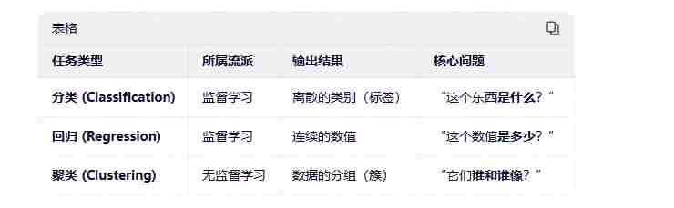
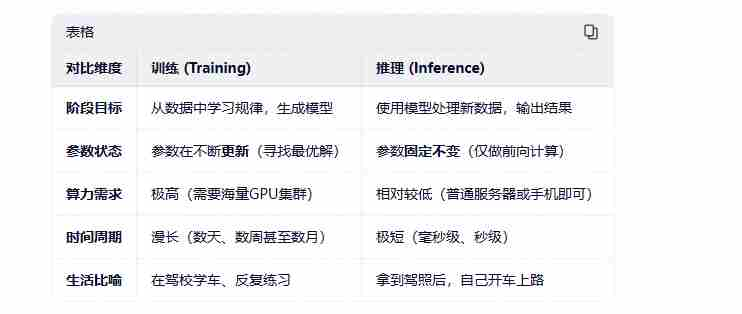

#### 问题1:什么是人工智能
```java
人工智能（Artificial Intelligence，简称 AI）是计算机科学的一个重要分支，其核心目标是研究和开发能够模拟、延伸和扩展人类智能的理论、方法、技术及应用系统。

让机器拥有人类的智慧 像人一样去 [感知] [思考] [学习]
```
#### 问题2:什么是机器学习
```java
机器学习（Machine Learning，简称 ML）是人工智能（AI）的核心分支。如果用一句话来概括它的本质，那就是：让计算机通过“看”大量的数据，自己总结出规律并学会做任务，而不是由人类把规则一行行写成代码。

让计算机看大量的数据 自己总结出规律并学会做任务 

1.传统编程：人类输入 数据 + 规则（代码） = 计算机输出 答案。定义规则 进行模式匹配
 比如：你写了一段代码，规定“如果图片里有尖耳朵和胡须，那就是猫”。如果猫趴着看不见耳朵，程序就认不出了。

2.机器学习：人类输入 数据 + 答案 = 计算机自己总结出 规则（模型）。
 比如：你给计算机看 1 万张猫的照片，并告诉它“这些都是猫”。计算机通过复杂的数学计算，自己找出了猫的特征规律。下次你再给它一张新照片，它就能自己判断是不是猫。
```
***
#### 问题3:机器学习 按学习方式的不同 可以细分成以下3种:
- 监督学习（Supervised Learning）：像“带答案的考试”。- 有标签的数据
```java
原理：给模型提供大量带有“标签”的数据，让它学习输入和输出之间的映射关系。
应用：垃圾邮件拦截（给模型看大量正常邮件和垃圾邮件，让它学会区分）、房价预测、图像识别。
```
***
- 无监督学习（Unsupervised Learning）：像“没有答案的自学”。- 无标签的数据
```java
原理：给模型一堆没有标签的数据，让它自己去发现数据内部的结构、规律或分类。
应用：客户群体细分（把消费习惯相似的人自动归为一类）、异常检测（发现信用卡盗刷）。
```
***
- 强化学习（Reinforcement Learning）：像“试错与奖励”。
```java
原理：模型在一个环境中不断尝试，做对了给奖励，做错了给惩罚。它通过不断试错来最大化获得的奖励。
应用：AlphaGo 下围棋、自动驾驶汽车、机器人控制。
```
***
#### 问题4:什么是深度学习
```java
深度学习（Deep Learning，简称 DL）是机器学习（Machine Learning）的一个极其重要的分支。如果用一句话来概括它的本质，那就是：通过构建多层的人工神经网络，让计算机像人类大脑一样，自动从海量数据中提取极其复杂的特征和规律。

通过构建多层的人工神经网络 让计算机像人类的大脑一样 自动从海量数据中提取出极其复杂的特征与规律

“深”（Deep）：指的是神经网络的层数非常多。传统机器学习可能只有一两层处理逻辑，而深度学习通常有几十层甚至上百层。

“学习”（Learning）：指的是模型通过不断调整内部数以亿计的参数（权重），来逼近现实世界的规律。
```
***
#### 问题5:什么是神经网络
```java
神经网络（Neural Network），全称人工神经网络（Artificial Neural Network），是深度学习的核心基石。如果用一句话来概括，那就是：它是一种模仿人类大脑神经元网络结构，通过海量节点相互连接来进行信息处理和学习的数学计算模型。
```
***
#### 问题6:什么是监督学习(Supervised Learning)
```java
定义：在训练模型时，喂给计算机的数据都是带有“标准答案（标签）”的。模型通过学习“输入数据”和“标准答案”之间的对应关系，总结出规律。当遇到新的未知数据时，模型就能根据学到的规律预测出答案。

通俗比喻：“带着标准答案的刷题考试”。
老师给你 1000 道数学题，并且附带了详细的标准答案。你通过做题和核对答案，掌握了数学公式和解题思路。最后老师给你一张全新的试卷，你就能自己算出正确答案。

常见任务：分类（如垃圾邮件拦截、图像识别）、回归（如房价预测、销量预测）。
```
***
#### 问题7:什么是无监督学习（Unsupervised Learning）
```java
定义：在训练模型时，喂给计算机的数据全都是“没有答案（无标签）”的。模型需要在没有任何提示的情况下，自己去探索、发现数据内部隐藏的结构、规律或共性。

通俗比喻：“没有老师指导的自学与归纳”。
老师给你一堆乱七八糟的积木，不告诉你它们是什么。你自己观察，发现有些是红色的，有些是圆形的，于是你按照颜色和形状把它们自动分成了几堆。

常见任务：聚类（如客户群体细分、新闻自动分类）、降维（如数据压缩、特征提取）。
```
***
#### 问题8:无监督学习（Unsupervised Learning） 与 什么是无监督学习（Unsupervised Learning） 最大的区别是什么
- 训练数据是否包含“标签（Label/标准答案）”，以及模型学习的目标是什么。

***
#### 问题9:什么是强化学习-通过奖惩机制来学习最优策略
```java
强化学习（Reinforcement Learning，简称 RL）是机器学习的三大核心流派之一。如果说监督学习是“带答案的刷题”，无监督学习是“没有答案的自学”，那么强化学习的本质就是：“在试错中摸索，通过奖惩机制来学习最优策略。”

在试错中进行探索 通过奖励机制来学习最优的策略
```
- 四个关键角色
```java
1.智能体（Agent）：学习者或决策者（比如：下棋的 AI、自动驾驶汽车）
2.环境（Environment）：智能体所处的外部世界（比如：棋盘、真实的马路）
3.动作（Action）：智能体对环境做出的反应（比如：移动棋子、踩油门）
4.奖励（Reward）：环境对智能体动作的反馈。做对了给正奖励（加分），做错了给惩罚（扣分）
```
- 通俗比喻：“训练小狗”或“玩超级玛丽”
```java
1.训练小狗：你让小狗坐下（动作），如果它做到了，你给它一块饼干（正奖励）；如果它乱跑，你大声呵斥它（惩罚）。经过多次尝试，小狗为了得到最多的饼干，就会完美掌握“坐下”的指令。

2.玩超级玛丽：AI 刚开始玩时完全瞎按手柄（探索）。如果掉进坑里，游戏结束（巨大惩罚）；如果吃到金币，分数增加（正奖励）。AI 在经历了无数次“Game Over”后，终于总结出了一套能吃到最多金币、避开所有陷阱的完美走法。
```
***
#### 问题10:强化学习 vs 监督学习：本质区别在哪？
```java
反馈的时机：监督学习是“即时反馈”，你做完一步，老师立刻告诉你标准答案对不对；强化学习是“延迟反馈”，你走了一步棋，可能要等几十步之后才知道这步棋是妙招还是臭棋。

数据的来源：监督学习的数据是别人准备好的；强化学习的数据是智能体自己通过“探索（Exploration）”和“利用（Exploitation）”在环境中互动产生的。
```
#### 问题11:回归、分类、聚类 - 对应的是任务类型
> 是什么
```java
// 回归、分类和聚类是机器学习中最基础、也最常见的三种任务类型
// 1.分类是“选阵营”
// 2.回归是“估数值”
// 3.聚类是“找圈子”
```
- 分类（Classification）—— “选阵营”
```java
核心定义：预测数据属于哪一个离散的类别。它的输出结果是一个标签（比如：是/否、猫/狗、垃圾邮件/正常邮件）。

通俗比喻：就像“分拣员”。你面前有一堆水果，你的任务是把它们准确地放进“苹果筐”、“香蕉筐”或“橘子筐”里。

实际场景：
    垃圾邮件拦截：判断一封邮件是“垃圾”还是“正常”。
    医疗诊断：根据体检指标判断患者是“健康”还是“患病”。
    图像识别：看一张照片，判断里面是“猫”还是“狗”。
```
***
-  回归（Regression）—— “估数值”
```java
核心定义：预测一个连续的数值。它的输出结果是一个具体的数字（比如：价格、温度、年龄、销量）。
通俗比喻：就像“估价师”或“预测员”。你手里有一套二手房，你需要根据它的面积、地段、房龄等信息，给出一个具体的“售价（如 350.5 万元）”。
实际场景：
 房价预测：根据房屋的各项指标预测未来的成交价格。
 销量预测：根据历史数据和节假日因素，预测下个月能卖出多少件商品。
 天气预报：预测明天的最高气温是 25.3℃。

```
***
- 聚类（Clustering）—— “找圈子”
```java
核心定义：将数据按照相似性自动分成若干个组（簇）。它不需要预先知道有哪些类别，也没有标准答案，纯粹靠数据自身的特征“物以类聚”。

通俗比喻：就像“幼儿园老师分组”。老师不知道这些孩子的名字和背景，但通过观察，她把喜欢画画的孩子分在一组，喜欢玩积木的孩子分在另一组，喜欢唱歌的孩子分在第三组。

实际场景：
    客户细分：电商平台根据用户的购买频率和消费金额，自动将用户分为“高价值VIP”、“价格敏感型”、“沉睡用户”等群体，以便精准营销。
    新闻分类：自动把全网最新的新闻按内容相似度归为“体育”、“科技”、“娱乐”等板块。
    异常检测：在信用卡交易中，把绝大多数正常交易聚在一起，那些偏离群体的交易就会被标记为“疑似盗刷”。
```
***
#### 问题12:回归、分类、聚类 任务类型的比对
- 分类和回归都是“有老师教”的（监督学习），只不过分类是让你选 ABCD，回归是让你填空写数字；而聚类是“自己摸索”的（无监督学习），让你把长得像的东西自动凑成一对

***
#### 问题13:什么是训练 什么是推理
```java
训练（Training）与推理（Inference）是人工智能（特别是机器学习和深度学习）生命周期中两个截然不同、却又紧密相连的阶段。

如果用一句话来概括它们的区别：训练是“上学读书、积累知识”的过程，而推理是“毕业考试、学以致用”的过程。
```
- 什么是训练（Training）？—— “学习的过程”
```java
核心定义：训练是指将海量的数据输入给模型，让模型通过不断试错和调整内部参数（权重），最终找到数据背后规律的过程。

通俗比喻：就像“学生备考”。老师（算法）给学生（模型）发了几万本练习册（训练数据）。学生做完一道题，对一下标准答案，发现做错了，就反思并调整自己的解题思路（反向传播与参数更新）。这个过程会重复成千上万次，直到学生能熟练解出各种题型。

核心特点：
    极度消耗资源：需要极其强大的算力（如成百上千张高端显卡）和漫长的时间（几天到几个月）。
    离线进行：通常在训练完成前，模型是不能用来对外服务的。
    产出物：训练的最终产物是一个“模型文件”（里面保存了数以亿计的参数权重），这就相当于学生毕业时拿到的一本“武功秘籍”。
```
- 什么是推理（Inference）？—— “应用的过程”
```java
核心定义：推理是指将训练好的模型部署到实际环境中，输入全新的、未知的数据，让模型根据之前学到的规律给出预测结果的过程。

通俗比喻：就像“学生上考场答题”。学生已经背熟了武功秘籍（模型），现在面对一张全新的试卷（新数据），他运用学过的知识迅速给出答案。

核心特点：
    要求低延迟：推理必须在极短的时间内完成（比如毫秒级），因为用户正在等待结果（比如你问我一个问题，我必须马上回答）。
    参数冻结：在推理阶段，模型的参数是固定不变的。它只负责计算，不再进行“反思和错题纠正”（不进行反向传播）。
    在线运行：推理通常发生在服务器端、手机或边缘设备上，直接面向终端用户。

没有高质量的训练，模型就是一个什么都不懂的“笨蛋”；而没有高效的推理，模型就永远只能待在实验室里，无法变成像“语音助手”、“自动驾驶”这样服务人类的实用工具。我们今天能顺畅地进行对话，正是因为我（大语言模型）在云端完成了庞大的训练，并正在以极高的效率为你进行推理。
```

***


