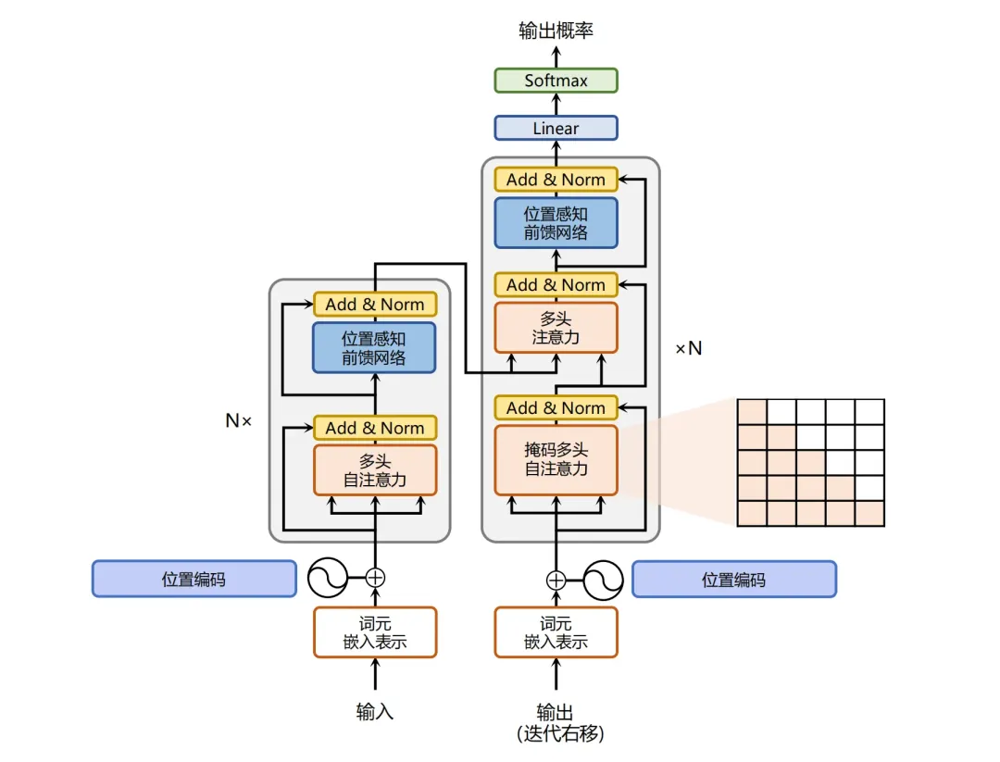

#### 问题1:大语言模型的大指的是什么
```java
参数量巨大 训练量巨大
```
***
#### 问题2:大语言模型的工作
```java
大语言模型的工作机制可以简单概括为：**基于上文预测下一个token**。具体来说，模型会根据输入的文本序列，逐个预测下一个词，直到生成完整的句子或段落。这一过程可以视为一个黑盒操作，输入一个问题，模型通过不断生成下一个词，最终形成一个完整的答案。
```
***
#### 问题3:如何理解

大语言模型的整体结构可以分为以下几个关键部分：
① 输入层：接收原始文本输入。
② 分词器（Tokenizer）：将输入文本分割成词或子词（token），以便模型进行处理。
③ Transformer 编码器（Encoder）| 自注意力机制：对输入的词进行编码，生成词的向量表示。
④ Transformer 解码器（Decoder）：基于编码器的输出，预测下一个词。
⑤ 输出层：生成最终的文本输出。
- 输入层（Input Layer）—— 工厂的“收货窗口”
```java
这是模型接收外部指令的入口。当你在对话框里输入“今天天气怎么样”时，这串文字就会进入输入层。
```
- 分词器（Tokenizer）—— 工厂的“切碎机与翻译官”
```java
计算机不懂人类的文字，只懂数字。分词器的作用是把完整的句子拆解成模型能认识的最小单位（Token，通常是字、词根或子词），并给每个 Token 分配一个唯一的数字 ID。
```
- Transformer 编码器（Encoder） / 自注意力机制 —— 工厂的“阅读理解中枢”
```java
（注：在 Decoder-only 模型中，这一步融合在了解码器内部）。它的核心任务是“理解上下文”。通过自注意力机制（Self-Attention），模型会分析句子中每个词与其他词的关系。比如看到“苹果”，它会根据上下文判断这里指的是“水果”还是“手机”。
```
- Transformer 解码器（Decoder）—— 工厂的“预测与生成引擎”
```java
这是大语言模型最核心的部分。它的工作方式本质上是“文字接龙”。它根据前面理解到的所有上下文信息，计算词汇表中每一个词作为“下一个词”的概率，然后挑出概率最高的那个词。接着，把这个新生成的词加到上下文中，再预测下下个词，如此循环往复。
```
- 输出层（Output Layer）—— 工厂的“出货与翻译窗口”
```java
解码器输出的其实是一长串代表词汇的数字 ID。输出层的作用是将这些数字 ID 反向转换回人类能看懂的文字（Token），并将它们拼接成完整的句子返回给你。
```
***
#### 问题4:Transformer 的工作流程
Transformer 的工作流程
① 输入处理：原始文本通过分词器被分割成一系列的词或子词。
② 编码阶段：Transformer 编码器对每个词进行编码，生成其向量表示，同时捕捉词与词之间的依赖关系。
③ 解码阶段：Transformer 解码器基于编码器的输出，逐个预测下一个词，直到生成完整的文本。
- 输入处理（Input Processing）—— “拆解与准备”
```java
计算机无法直接理解人类的语言，所以第一步必须把人类的话翻译成机器能懂的“数字”。分词器（Tokenizer）就像一把剪刀，把完整的句子剪成一个个小零件（Token），并给它们贴上数字标签。
```
- 编码阶段（Encoding）—— “深度阅读与理解”
```java
这是编码器（Encoder）的核心工作。它接收所有的输入 Token，通过“自注意力机制”，不仅知道每个词的意思，还瞬间理清了整句话的语法结构、上下文逻辑和指代关系。最终，它把整句话浓缩成一组包含了全部信息的“高维向量矩阵”。
```
- 解码阶段（Decoding）—— “看图说话与逐字生成”
```java
这是解码器（Decoder）的核心工作。它手里拿着编码器给出的“概念地图”，开始自回归（Autoregressive）地生成新文本。它每次只预测“下一个词”，然后把预测出的词加到已有句子中，再预测下下个词，直到生成结束符。
```


