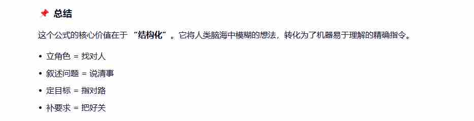

#### 问题1:什么是Prompt
```java
Prompt（提示词）是人与 AI 模型交互的“指令”或“输入”。你可以把它想象成你给 AI 下达的任务书或沟通的桥梁。AI 本身并没有自主意识，它完全依赖 Prompt 来理解你的意图，并据此生成相应的回答或内容。
```
***
#### 问题2:什么是Prompt工程
> 背景
```java
Prompt 工程（Prompt Engineering，提示词工程），简单来说，就是一门“教 AI 听懂人话并完美干活”的科学与艺术。
如果把大语言模型（如 Qwen、ChatGPT）比作一个拥有海量知识但偶尔有些“一根筋”的超级实习生，那么 Prompt 工程就是你编写工作说明书、沟通技巧和流程优化的方法论。它不仅仅是“随便问个问题”，而是通过系统性地设计、优化和迭代提示词，来引导 AI 输出最准确、最符合预期的结果。
```
> 是什么
```java
Prompt工程通过设计提示词 以确保LLM最佳输出过程称为[提示词工程] 由于LLM对提示词的变化极其的敏感 提示词非常微小的改动 会导致LLM大相径庭的输出 
通俗的讲  通过精心设计指令 提升LLM单次特定任务的回答准确率
```
***


#### 问题3:一个好的提示词的4要素
- 【立角色】
```java
告诉 AI 它应该扮演什么身份。例如：“你是一个资深的心理咨询师”或“你是一个精通 Python 的程序员”。这能引导 AI 调整其回答的语气、专业度和视角。
```
- 【叙述问题】
```java
告诉 AI “发生了什么”或“现状是什么”。这是任务的背景信息，包括输入的数据、遇到的困难、或者具体的场景描述。
```
- 【定目标】
```java
告诉 AI “你要做什么” 要达到什么效果 这是指令中最关键的动作部分，必须清晰、具体。
```
- 【补要求】
```java
告诉 AI “怎么做”以及“做成什么样”。这是对输出的格式、风格、字数、禁忌等的限制。
```
***

***
#### 问题4:提示词案例拆解分析
> 提示词
```java
你现在是一个专业的软件需求分析师与应用架构师 后面的问题 请你以专业人士的视角回答 我要做员工打卡的考勤应用 请你帮忙生成一份需求文档 与 样例代码 做个Demo 代码用python输出
```
> 分析
```java
// 1.立角色
		// 1.1 你现在是一个专业的软件需求分析师与应用架构师

// 2.叙述问题
		// 2.1  请你以专业人士的视角回答 我要做员工打卡的考勤应用

// 3.定目标
		// 3.1 请你帮忙生成一份需求文档 与 样例代码

// 4.补要求
		// 4.1 做个Demo 代码用python输出
```
***
#### 问题5:如何进行提示词的优化
> 核心优化原则
```java
// 1.明确任务与角色
	// 1.1 清晰定义任务目标与模型角色（如“作为信息抽取专家”）
	// 1.2 避免模糊描述，限定输出格式（JSON/表格/分点）
// 2.信息密度与结构
	// 2.1 控制Prompt长度在100-300字黄金区间
	// 2.2 采用“总述-分点-原因-方案-总结”分层结构
```
> 关键优化技巧
```java
// 1.少样本学习（Few-shot）
	// 1.1 提供1-3个优质示例引导输出风格
	// 1.2 示例需覆盖任务典型场景与期望格式
// 2.思维链（Chain of Thought）
	// 2.1 添加“让我们一步步思考”等引导词
	// 2.2 强制模型分步推导，避免逻辑跳跃
// 3.角色化提示
	// 3.1 锁定专业角色（如AI产品经理/研发工程师）
	// 3.2 模型自动采用结构化职业思维输出
```
> 实用模板
```java
# 高阶优化模板  3   6 
角色：[专业角色，如“资深算法工程师”]
任务：[具体任务描述]
输出要求：
1. 采用[指定结构，如“总-分-总”]
2. 分步骤推导核心逻辑
3. 每个结论需附依据
4. 禁止重复和冗余内容
示例：[1-2个典型示例]
```
#### 问题6:多模态信息提取方法
多模态指的是什么: 视频 音频 图像
```java
// 核心逻辑：采用"文本引导+模态补充"策略，文本提示明确任务需求，图像/音频等模态提供上下文信息
// 1.关键技术流程：
	// 1.1 数据预处理：对异构模态数据标准化（文本向量化、图像特征编码、语音频谱分析）
	// 1.2 跨模态注意力机制：建立模态间关联矩阵，动态调整各模态特征权重
	// 1.3 分层特征提取：依次执行上下文语义理解、实体关系建模、核心信息定位

```
> 多模态提示核心构建技巧
```java
1. 明确任务与格式约束
	指定输出格式：明确要求JSON、表格等结构化输出 
	限定回答范围：聚焦特定区域或特定方面

案例对比：
模糊提示：“这张图说明什么” → 浅层回答 2
明确提示：“根据天气图分析明天应该穿什么衣服” → 实用建议
```
> 样例
```java
反例：直接提问得到模糊答案"很快就会用完"
优例：分步指令：
1. 数图片中卫生纸卷数
2. 估算日均使用量  
3. 计算总使用时长  1 

```


